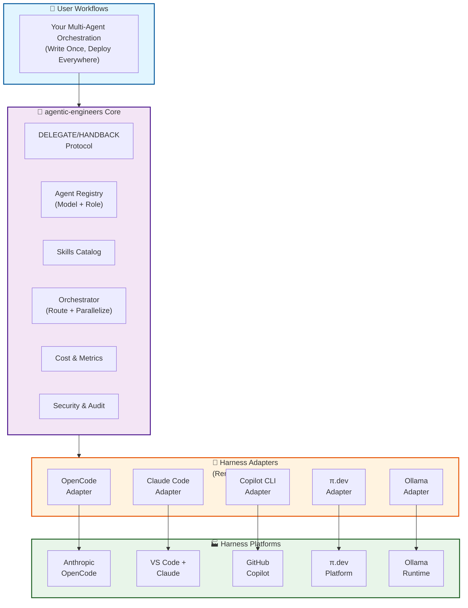
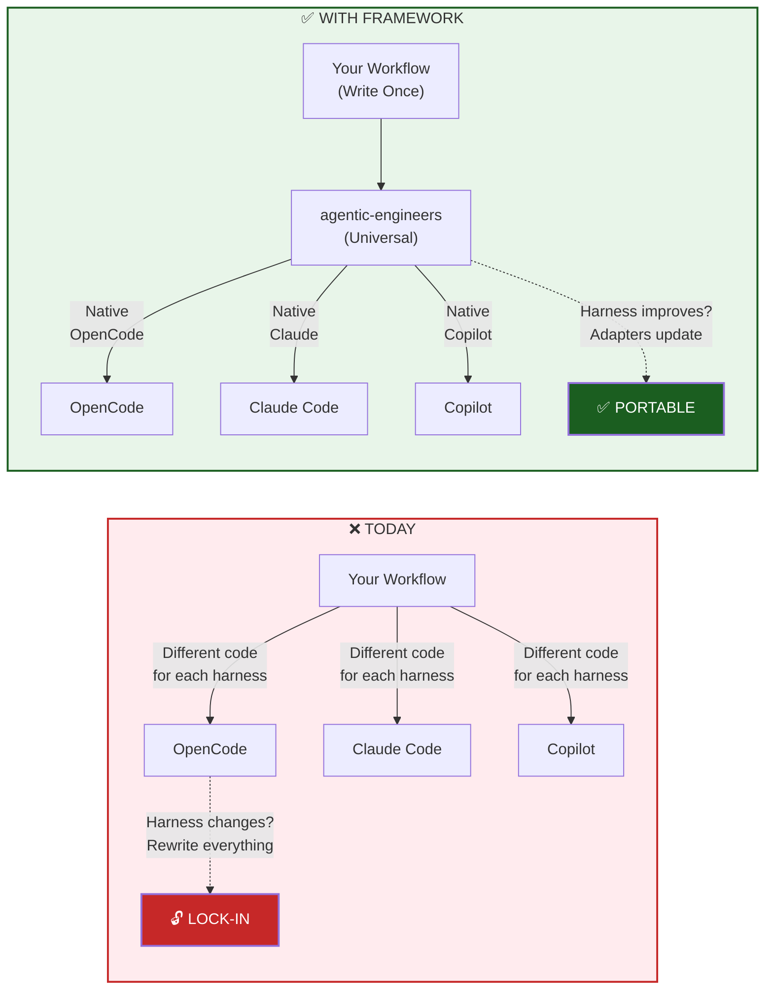
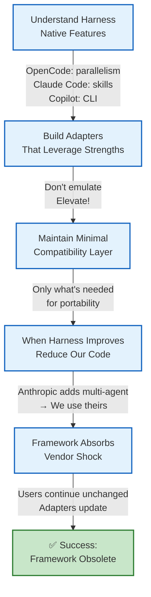
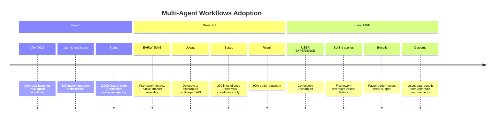
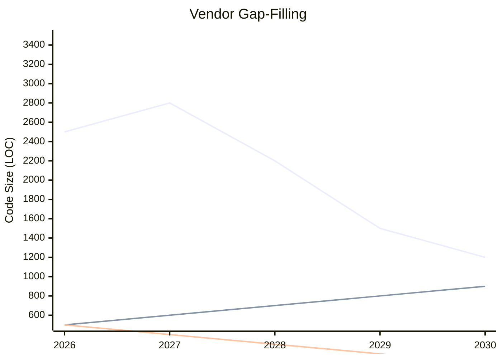
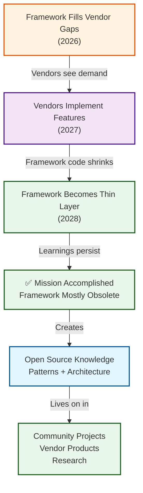
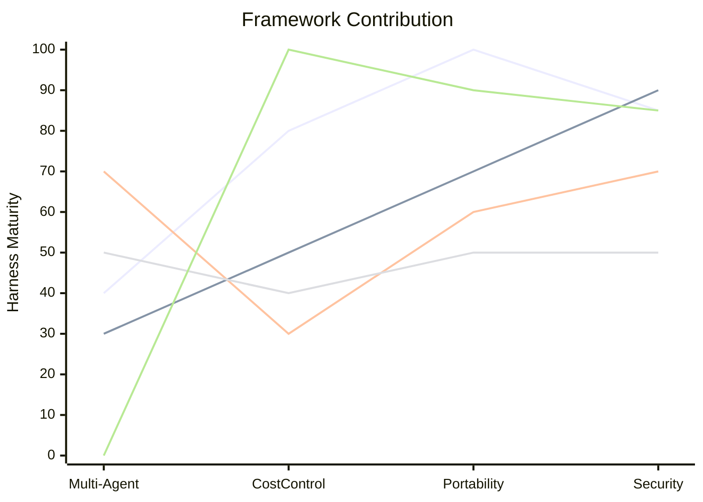
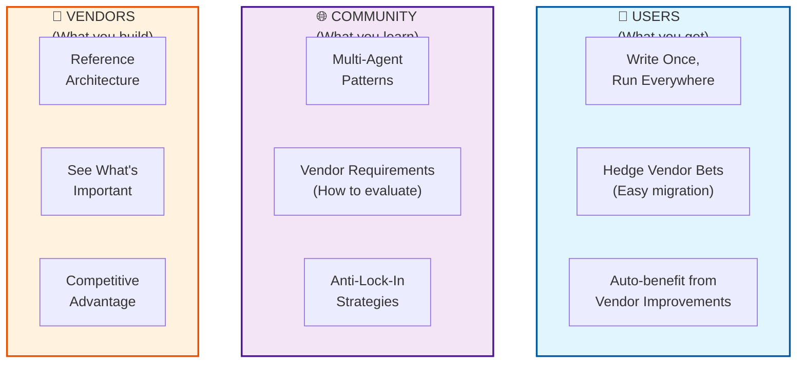
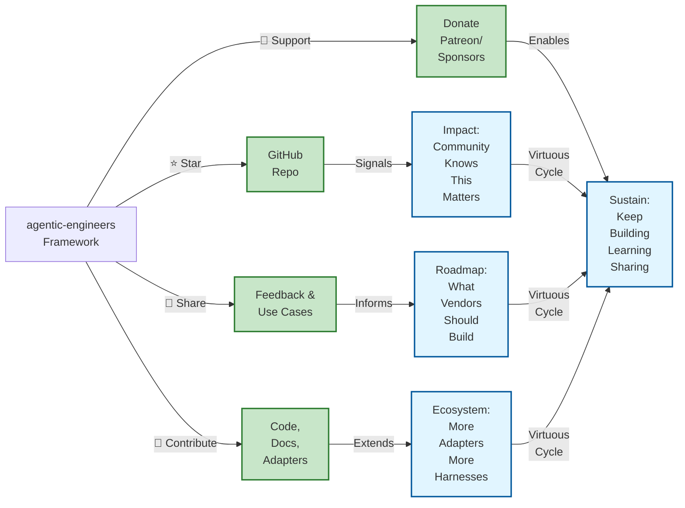

# Architecture Overview

# Problem: Vendor Lock-In

# Harness Integration Philosophy

# Evolution Example: Multi-Agent Workflows

# Framework Code Size Over Time

**Goal**: By 2028, framework is 90% smaller, mostly documentation & examples

# Success = Obsolescence

# Multi-Harness Strategy (Q2 2026)

# Value Proposition: The Three Circles

# Call to Action

